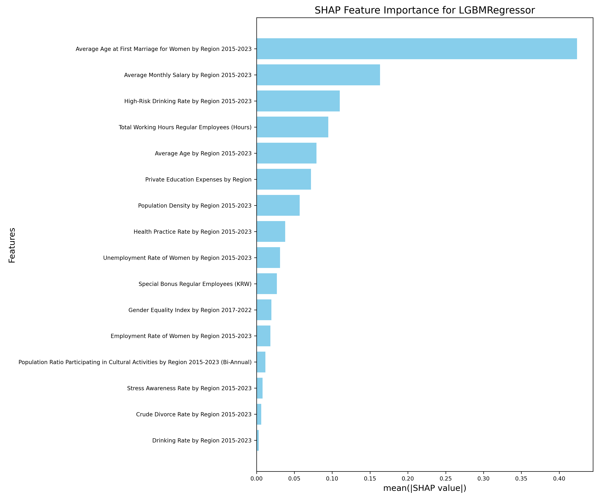
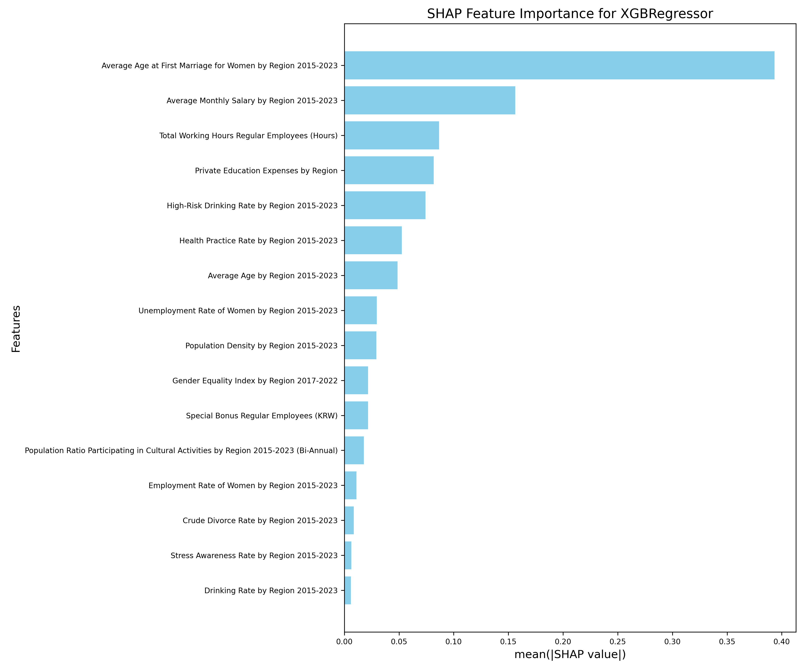
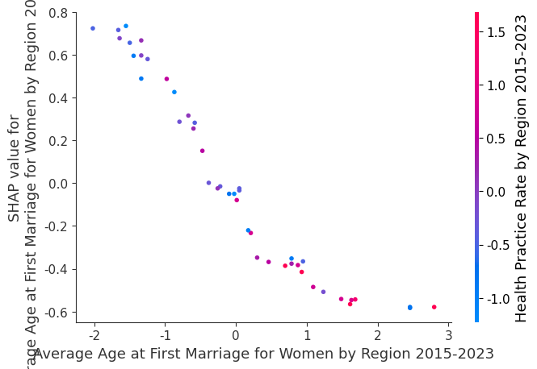
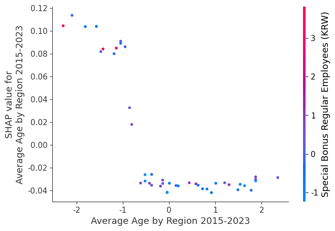
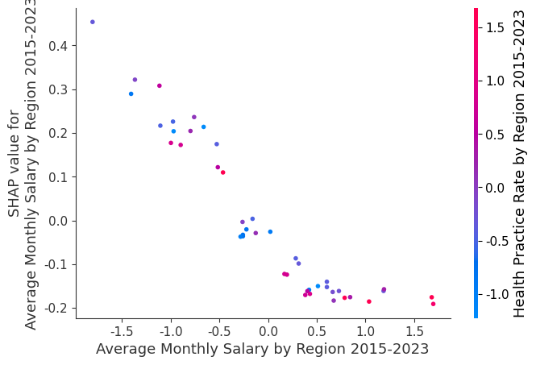
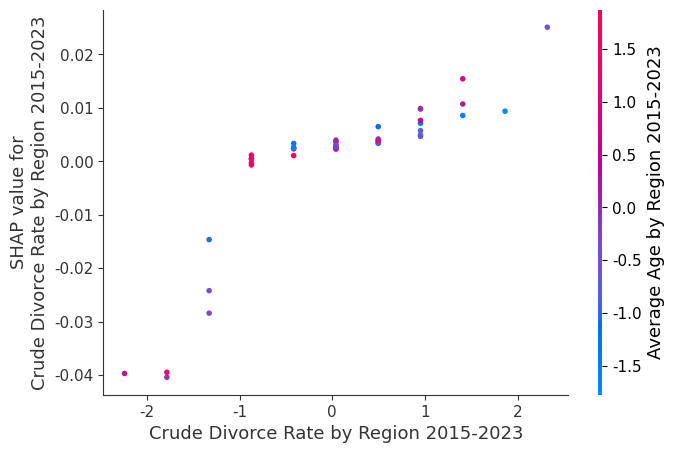
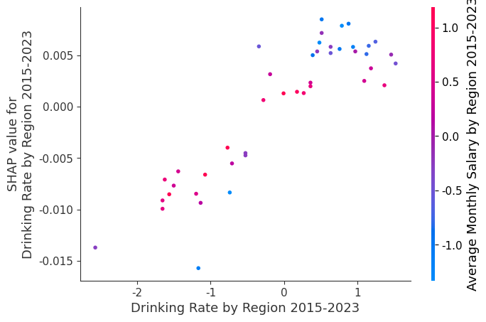

# Explainable Fertility Analysis

This repository provides an explainable machine learning approach to analyze factors affecting fertility rates across various regions. Using SHAP (SHapley Additive exPlanations) values, we identify the most critical features and their contributions to model predictions.

## Overview

The project uses two state-of-the-art gradient boosting algorithms: **XGBoost** and **LightGBM**, to predict fertility rates. These predictions are explained with SHAP, which allows us to understand the impact of different socio-economic and regional factors.

## Data
We used open public data from KOSIS, ranging Social/Economical/Cultural/Regional/and other factors that describe Korean society from 2015-2023.
Some data include:

```
| Region  | Year | GRDP per Capita (2015-2022) | Regular Workdays (Days) | Regular Work Hours (Hours) | Monthly Salary (KRW) | Fixed Salary (KRW) | Overtime Hours (Hours) | Overtime Salary (KRW) | Total Work Hours (Hours) | Special Bonus (KRW) | Total Fertility Rate (2015-2023) | Single-Person Household Ratio | Health Practice Rate (2015-2023) | Economic Participation Rate (2015-2023) | Employment Rate (2015-2023) | High-Risk Drinking Rate (2015-2023) | Aging Index (2015-2023) | Cultural Facilities per 100K People (2015-2022) | Cultural Activity Population Ratio (2015-2023) | Private Education Expenses | Gender Equality Index (2017-2022) | Income (2015-2022) | Stress Awareness Rate (2015-2023) | Unemployment Rate (2015-2023) | Female Economic Participation Rate (2015-2023) | Female Employment Rate (2015-2023) | Female Unemployment Rate (2015-2023) | Female Youth Ratio (19-39) (2015-2023) | Female Average Marriage Age (2015-2023) | Average Monthly Wage (2015-2023) | Drinking Rate (2015-2023) | Population Density (2015-2023) | Crude Divorce Rate (2015-2023) | Crude Marriage Rate | Youth Ratio (19-39) (2015-2023) | Average Age (2015-2023) |
|---------|------|-----------------------------|--------------------------|-----------------------------|-----------------------|--------------------|--------------------------|------------------------|----------------------------|---------------------|---------------------------------|-------------------------------|----------------------------------|--------------------------------|------------------------|--------------------------------|-------------------------|------------------------------------------|-----------------------------------------|------------------------|----------------------------------|----------------------|--------------------------------|----------------------------------|------------------------|--------------------------------|----------------------------------|-------------------------|--------------------------|----------------------------|--------------------------|-----------------------|-------------------------|-------------------|
| Gangwon | 2015 | 27608                      | 22.3                     | 174.0                       | 2569139               | 2569139            | 162.7                    | 1627.8                 | 192.4                      | 140000              | 1.18                           | 19.8                          | 25.5                             | 53.3                           | 45.4                  | 7.3                            | 15.2                   | 8.4                              | 13.2                                  | 124.7                    | 0.5                              | 123                  | 4.3                             | 32.8                             | 45.3                  | 50.5                             | 29.3                             | 2.1                          | 63.5                     | 182.0                      | 3.1                          | 19.1                     |
| Gangwon | 2016 | 29380                      | 21.0                     | 170.0                       | 2700000               | 2700000            | 157.3                    | 1400.0                 | 184.6                      | 142000              | 1.20                           | 21.2                          | 25.8                             | 54.1                           | 46.0                  | 6.8                            | 16.1                   | 9.2                              | 14.1                                  | 133.3                    | 0.6                              | 130                  | 4.0                             | 34.2                             | 46.1                  | 52.0                             | 30.0                             | 2.0                          | 62.8                     | 190.0                      | 2.9                          | 19.3                     |
| Gangwon | 2017 | 31200                      | 20.8                     | 165.3                       | 2830000               | 2830000            | 151.2                    | 1300.0                 | 176.5                      | 150000              | 1.23                           | 22.5                          | 26.2                             | 55.0                           | 47.5                  | 6.5                            | 17.0                   | 10.1                             | 15.3                                  | 140.8                    | 0.7                              | 140                  | 3.8                             | 35.5                             | 47.3                  | 53.2                             | 30.8                             | 1.9                          | 61.7                     | 198.0                      | 2.7                          | 19.6                     |
| Gangwon | 2018 | 32267                      | 21.3                     | 169.4                       | 2980000               | 2980000            | 153.0                    | 1500.0                 | 180.4                      | 160000              | 1.26                           | 23.1                          | 26.6                             | 56.0                           | 48.0                  | 6.1                            | 18.1                   | 10.9                             | 16.3                                  | 148.2                    | 0.8                              | 145                  | 3.5                             | 36.8                             | 48.0                  | 54.2                             | 31.5                             | 1.8                          | 60.3                     | 206.0                      | 2.6                          | 19.8                     |
```

## Results

### SHAP Feature Importance

The SHAP feature importance plots illustrate the overall impact of features:

- **LightGBM SHAP Importance**  
  

- **XGBoost SHAP Importance**  
  

### SHAP Dependence Plots

These plots show how specific features influence the model's prediction for fertility rates:

- **Average Age at First Marriage**  
  

- **Average Age**  
  

- **Average Monthly Salary**  
  

- **Crude Divorce Rate**  
  

- **Drinking Rate**  
  

## Repository Structure

```
explainable_fertility-main/
├── data/                     # Raw and preprocessed data files
├── output_metrics/           # Evaluation metrics for models
├── result/                   # Plots and visualizations
├── shap_data_preprocess.ipynb # Preprocessing code for SHAP
├── shap_model.ipynb          # SHAP model training and analysis
└── shap_legacy.ipynb         # Legacy SHAP experiments
```

## License

This project is licensed under the MIT License.
